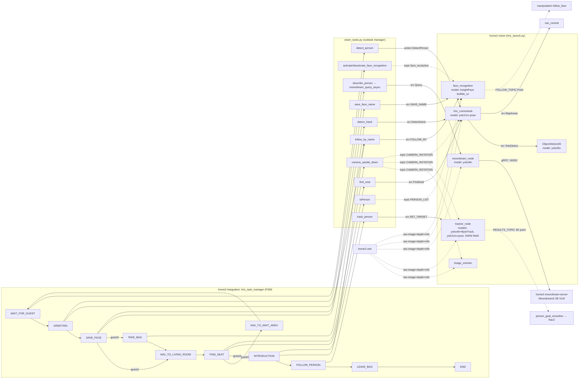

# HRIC vision architecture — models → nodes → interfaces → subtask manager → FSM

Audited 2026-07-02 against `hric_task_manager.py`, `vision_tasks.py`, `hric_launch.py`
and every vision node. This is the *actual* wiring, not the intended one — mismatches
are called out at the end.

> 🖼 **Full vision-area visual diagram** (all packages/tasks, not just HRIC):
> [`diagrams/vision_architecture.svg`](diagrams/vision_architecture.svg) /
> [`.png`](diagrams/vision_architecture.png)

## 1. What runs for HRIC (launch set)

`vision/packages/vision_general/launch/hric_launch.py` starts **6 nodes** (vision
container). The Moondream gRPC server runs in its own container (`home2-moondream-server`),
the ZED camera in `home2-zed`.

| Node | Executable | ML models loaded | Purpose in HRIC |
|---|---|---|---|
| `face_recognition` | `face_recognition_node.py` | InsightFace `buffalo_sc` (TRT/CUDA) | save/recognize guest faces, publish follow-face point |
| `hric_commands` | `hric_commands.py` | YOLO `yolo11m-pose` (TRT) | FindSeat srv, DetectPerson action, DetectHand srv |
| `moondream_node` | `moondream_run/moondream_node.py` | YOLO `yolov8n` (person crop) + gRPC→ **Moondream2 2B VLM** | describe_person queries, beverage location |
| `image_orienter` | `image_orienter.py` | — | rotate raw camera frames per CAMERA_ROTATION_TOPIC |
| `ObjectDetect2D` | `object_detector_2d/object_detector_node.py` | YOLO `yolo26n` (`yolo_generic`) | serves `YoloDetect` (persons/chairs/couches for hric_commands) |
| `tracker_node` | `tracker_node.py` | YOLO `yolov8n`+ByteTrack (TRT), `yolo11m-pose` (PoseDetection), SWIN ReID (lazy) | person tracking for FOLLOW_PERSON |

**Model duplication (VRAM cost, same weights loaded twice):**
- `yolo11m-pose`: loaded by **hric_commands** (wrists only) *and* **tracker_node** (PoseDetection).
- `yolov8n`: loaded by **tracker_node** *and* **moondream_node** (person cropping).
- SWIN ReID loads in tracker even though re-acquisition is still a TODO.

## 2. Camera/data plumbing

```
home2-zed ──CAMERA_TOPIC(raw)──┬─▶ image_orienter ──IMAGE_ORIENTED_TOPIC──┬─▶ face_recognition
          ──DEPTH_IMAGE_TOPIC──┤        ▲                                 └─▶ hric_commands
          ──CAMERA_INFO_TOPIC──┤        │ CAMERA_ROTATION_TOPIC (Int16 0/180)
                               │        │   published by vision_tasks.camera_upside_down()
                               ├─▶ tracker_node   (subscribes RAW + rotation, flips internally)
                               └─▶ moondream_node (subscribes RAW, NO rotation handling ⚠)
```

⚠ `moondream_node` consumes the **raw** camera topic with no rotation compensation. Today
this is safe only because `describe_person` runs in SAVE_FACE (camera upright); any future
moondream call while carrying the bag (camera at 180°) would query upside-down frames.

## 3. FSM state → subtask call → interface → node → model

| FSM state | vision_tasks call | ROS interface (frida_interfaces) | Node | Model used |
|---|---|---|---|---|
| init / all navigate states | `deactivate_face_recognition()` | topic `/vision/face_recognition/active` (Bool, hardcoded string) | face_recognition | — (pauses InsightFace) |
| init, FIND_SEAT | `camera_upside_down(bool)` | topic CAMERA_ROTATION_TOPIC (Int16) | image_orienter, tracker, hric_commands | — |
| WAIT_FOR_GUEST | `detect_person(timeout=10)` | **action** DetectPerson @ CHECK_PERSON_TOPIC | hric_commands → calls `YoloDetect` srv | yolo26n (class 0) |
| GREETING | `activate_face_recognition()`; `follow_by_name("area")` | srv SaveName @ FOLLOW_BY_TOPIC | face_recognition | InsightFace |
| GREETING (arm) | *(manipulation.follow_face)* consumes | topic FOLLOW_TOPIC (Point) | face_recognition → manipulation | InsightFace |
| SAVE_FACE | `save_face_name(name)` | srv SaveName @ SAVE_NAME_TOPIC | face_recognition | InsightFace |
| SAVE_FACE (guest 1) | `describe_person(cb)` → N× `moondream_query_async` | srv Query @ QUERY_TOPIC | moondream_node → gRPC :50052 | yolov8n crop + Moondream2 |
| TAKE_BAG (guest 2) | `detect_hand()` ×5 retries | srv DetectHand @ DETECT_HAND_SERVICE | hric_commands | yolo11m-pose (wrists) + depth |
| FIND_SEAT | `find_seat()` per pan angle (9-angle sweep) | srv FindSeat @ FIND_SEAT_TOPIC | hric_commands → `YoloDetect` srv + `MapAreas` srv (nav_central) + TF + depth | yolo26n (classes 0/56/57) |
| INTRODUCTION | `follow_by_name(guest)`, `isPerson(name)` | FOLLOW_BY_TOPIC srv; PERSON_LIST_TOPIC topic (sub) | face_recognition | InsightFace |
| FOLLOW_PERSON | `track_person(True/False)` | srv SetBool @ SET_TARGET_TOPIC | tracker_node → RESULTS_TOPIC (PointStamped) → nav `person_goal_smoother` | yolov8n+ByteTrack (+pose, ReID) |
| (unused by TM) | `get_person_name()` | PERSON_LIST/PERSON_NAME topics | face_recognition | InsightFace |

Non-vision areas per state (for context): HRI (`say`, `ask_and_confirm` STT/LLM,
`interpret_keyword` stop-words, display topics, door events), Manipulation (`follow_face`,
`move_to_position`, `pan_to`, `point`, `go_to_hand`, gripper, `place_on_floor`,
`follow_person`), Nav (`move_to_location`, `follow_person`).

## 4. Full connection diagram



## 5. Needed vs. loaded — findings

**Actually required by the HRIC TM:** all 6 launched nodes are used. No dead nodes in
the launch set (pointing_detection, gpsr_commands, etc. correctly excluded).

**Mismatches in `vision_tasks.services[Task.HRIC]` (startup service checks):**
- `beverage_location` and `moondream_query` are checked at startup, but the TM never
  calls `find_drink`; `moondream_query` is used only via `describe_person`.
- `track_person` (SET_TARGET_TOPIC) **is used** by FOLLOW_PERSON but is registered under
  `Task.HELP_ME_CARRY` — HRIC startup never verifies the tracker is up. Add it to the
  HRIC dict.

**Redundancies / improvement candidates:**
1. Double-loaded weights: `yolo11m-pose` ×2, `yolov8n` ×2 (§1). A shared pose service
   (or hric_commands reusing the tracker's PoseDetection via a srv) frees VRAM.
2. Person detection exists 3 ways (YoloDetect class 0, tracker, face rec) — acceptable
   (different latencies), but detect_person could read the tracker topic instead of a
   fresh YOLO service round-trip.
3. `moondream_node` should subscribe to IMAGE_ORIENTED_TOPIC (or handle rotation) — see §2.
4. `find_seat` house-filter needs the async MapAreas cache pattern (blocking in-callback
   fetch can never complete on hric_commands' single-threaded executor; caused the
   2026-07-02 8s-timeout loop). Fix exists on the Orin working tree.
5. `hric_commands.check_couches` must clamp bbox x2 (=image width crash, 2026-07-02).
6. Hardcoded `"/vision/face_recognition/active"` topic string in both vision_tasks.py
   and face_recognition_node.py — move to frida_constants.

**Test harness:** `task_manager/scripts/test/test_hric_vision.py` exercises exactly the
§3 call sequence (vision only, no nav/manip/HRI), validates every return is a proper
`(Status, ...)`, and supports `mock_data`/`steps` params.

## 6. Active-task launch audit (2026-07-02)

Active task managers: **gpsr, doing_laundry (--dlc), hric, restaurant, pick_and_place (--ppc)**.
`docker/vision/run.sh` maps each flag to one launch file; the container runs exactly that
launch (no-flag runs = plain bash, nothing implicit).

**IMPORTANT (audit gotcha):** `gpsr_launch.py`, `ppc_launch.py` and `restaurant_launch.py`
pull in `object_detector_node.launch.py` via `IncludeLaunchDescription` — and that include
starts BOTH `object_detector_node` AND `image_orienter`. When auditing a launch, grep for
`IncludeLaunchDescription`, not just `Node(executable=...)`. So `detect_objects`/`YoloDetect`
have servers in every active task.

| Task | Launch file | DEAD (launched, never called) | Bugs |
|---|---|---|---|
| hric | `hric_launch.py` (nodes listed explicitly, no include) | — complete, no dead weight | — |
| gpsr | `gpsr_launch.py` (+detector include) | trash_detection_node | `read_qr` in GPSR dict has no server |
| restaurant | `restaurant_launch.py` (+detector include) | **face_recognition_node** (zero face calls; InsightFace VRAM + always-hot 5 Hz timer) | **image_orienter launched TWICE** — explicit Node *and* via the include (duplicate IMAGE_ORIENTED frames, double rotation CPU); gpsr_launch's comment warns exactly against this |
| pick_and_place | `ppc_launch.py` (+detector include) | trash_detection_node | — |
| doing_laundry | `ppc_launch.py`, PROFILES=vision only | trash_detection_node **and** moondream_node (its gRPC server container isn't started — no moondream profile for --dlc; laundry doesn't call moondream anyway) | — |

Dead everywhere (safe to remove from launches / clean up):
- `trash_detection_node` — **no client anywhere in task_manager** (TRASHCAN service unused;
  `detect_trash()` uses moondream instead). Also has broken response paths.
- `read_qr` (GPSR services dict) and `detect_shelf` — no server exists for either.
- `generic_tasks.pan_to_person` / `vision.person_bounding_box` — half-implemented pseudocode,
  attribute doesn't exist on VisionTasks; only imported by inactive help_me_carry.
- `--carry` maps to `help_me_carry_launch.py` which does not exist (would fail to launch).
- Not launched by any active task (repo cruft only): is_person_inside (broken),
  person_in_map, dishwasher_node, zero_shot + pointing_detection (storing/carry only).
- In-node weight: tracker still carries unused DeepSORT code (ByteTrack replaced it);
  moondream PERSON_POSTURE srv references a commented-out attribute.

## 7. Follow-person pipeline rework (2026-07-03)

Applied across tracker / smoother / arm controller to stop losing the person
(validate on robot with `ros2 run task_manager follow_calibration.py`):

- **tracker_node**: ALL SWIN ReID work (gallery embeds + re-acquisition matching)
  moved to a background worker thread with target-generation stamps — the 20 Hz
  (was 10 Hz) tracking tick never blocks on ReID. Arm centroid now publishes for
  EVERY tracked frame (used to sit behind the depth gate). Depth-jump rejection
  accepts after 3 consecutive rejects (a legit move used to wedge RESULTS_TOPIC
  silent forever). RGB/depth stamp gate 50→100 ms. Debug drawing skipped unless
  someone subscribes (`DebugImagePublisher.has_subscribers()`).
- **person_goal_smoother**: person-velocity estimate + `lead_time` (0.4 s) leads
  the goal ahead of a walking person; on tracker loss (`timeout` now 2.0 s) it
  drives to the person's LAST-KNOWN position facing their direction of travel
  (`lost_behavior:=halt` restores the old freeze-in-place).
- **follow_person_controller** (arm): PID (kd computed at centroid rate in the
  subscriber, LPF'd), kp 1.0→1.8, max_vel 0.8→1.2, joint1 range widened to
  [-3.05, -0.2] with a velocity TAPER over the last 0.35 rad (no more hard-stop
  slams — the old xArm fault mode), recenters to neutral on centroid timeout,
  MultiThreadedExecutor (mode-switch sleeps no longer stall the control loop).
- **nav2_omni_following.yaml**: vx/vy 0.35→0.5 (the 0.35 cap was the dominant
  loss cause — slower than a walking person).

Suggested launch fixes: remove the explicit `image_orienter` Node from `restaurant_launch.py`
(the detector include already starts it); drop `trash_detection_node` from gpsr/ppc launches;
drop `face_recognition_node` from `restaurant_launch.py`; for --dlc drop `moondream_node`
from the launch (or add the moondream profile if it should be available).
