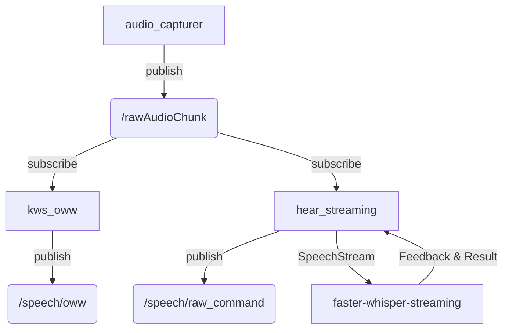

# Human Robot Interaction (HRI)

## Tree structure

```bash
home2/
│
│frida_constants/ # Constants for the project
├──data/ # Files with information like names and objects
├──frida_constants/
│   └──hri_constants.py # Constants such as topic names and other values
│
│frida_interfaces/ # Contains the ROS interfaces for the project
├──hri/
│   ├──action/
│   ├──msg/
│   └──srv/
│
│hri/
├──display/
│   ├──index.ts # ROS to websockets backend
│   └──web-ui/
│       ├──components/
│       │   └──ui/ # Shadcn components
│       └──app/
│           ├──components/ # React UI components
│           ├──hooks/ # React hooks and functions
│           ├──types/
│           │   └──index.ts # Interfaces and types
│           ├──layout.tsx # Root layout
│           └──page.tsx # Main page
│
├──packages/ # ROS packages for the project
│   ├──embeddings/
│   │   ├──config/ # ROS launch configs. REPLACE keyword uses hri_constants.py values
│   │   ├──embeddings/
│   │   │   └──dataframes/ # Json files with data
│   │   ├──launch/ # ROS launch files
│   │   │   └──embeddings_launch.py # Launches knowledge base node
│   │   └──scripts/ # Classes, functions and nodes
│   ├──nlp/
│   │   ├──assets/ # Persists models
│   │   ├──config/ # ROS launch configs. REPLACE keyword uses hri_constants.py values
│   │   ├──launch/ # ROS launch files
│   │   │   ├──extract_data_launch.py # Launches extract data node
│   │   │   └──nlp_launch.py # Launches NLP nodes
│   │   ├──nlp/
│   │   │   └──assets/
│   │   │       ├──data_extraction_priority.py
│   │   │       ├──dialogs.py # Prompts
│   │   │       └──schemas.py
│   │   ├──scripts/ # ROS nodes
│   │   └──test/ # ROS nodes
│   └──speech/
│       ├──assets/
│       │   ├──downloads/ # Persists models
│       │   │   └──offline_voice/ # Gets created on run.sh for TTS
│       │   │       ├──audios/ # Persists .wav files
│       │   │       ├──model/ # Persists model
│       │   │       └──audio_cache.json/ # Maps texts to audio files
│       │   └──oww/ # Open Wake Word models
│       ├──config/ # ROS launch configs. REPLACE keyword uses hri_constanst.py values
│       ├──debug/ # Scripts for debugging
│       ├──launch/ # ROS launch files
│       │   ├──devices_launch.py # Launches speech nodes
│       │   └──hri_launch.py # Launches both NLP and Speech nodes
│       ├──scripts/ # ROS nodes
│       │   ├──stt/ # gRPC microservice for Speech To Text
│       │   └──tts/ # gRPC microservice for Text To Speech
│       ├──speech/ # Static util functions
│       ├──CMakeLists.txt # Description of compilation of the package
│       └──package.xml # Declare dependencies of the package
│
└──requirements/ # Python dependencies for the project
    ├──nlp.txt
    ├──postgres.txt
    └──speech.txt
```

## Setup speech default sink and source

Sinks and sources are the audio devices that pulseaudio uses to play and record audio. Setting the default sink and source is useful to make sure that the audio is played and recorded from the correct device.

```bash
# Set default sink
nano ~/.config/pulse/default.pa
# Add the following line

# Respeaker 4 mic array
set-default-source alsa_input.usb-SEEED_ReSpeaker_4_Mic_Array__UAC1.0_-00.multichannel-input

# Frida's speaker
set-default-sink alsa_output.usb-GeneralPlus_USB_Audio_Device-00.analog-stereo

# Restart pulseaudio (add to .bashrc)
pulseaudio -k && pulseaudio --start
```

## Speech pipeline

### audio_capturer.py

Captures raw audio in chunks and publishes it.

### kws_oww.py

Uses Open Wake Word to detect keywords such as "Frida".

### hear_streaming.py

Takes audio, performs STT with gRPC service and publishes it.

### faster-whisper-streaming.py

Serves gRPC server and defines Transcribe function which performs STT using faster-whisper and returns feedback live.



## Testing the project

Most of the final commands will be executed using `run.sh`. However, here are some testing commands:

```bash
# Launch HRI (includes speech, and nlp)
ros2 launch speech hri_launch.py

# Speech (Remember to start the stt docker before, this is done automatically if running the hri docker compose file)
ros2 launch speech devices_launch.py

# Say something
ros2 service call /hri/speech/speak frida_interfaces/srv/Speak "{text: \"Go to the kitchen and grab cookies\", speed : 1.0}"

# Extract data from a sentence
ros2 service call /hri/nlp/data_extractor frida_interfaces/srv/ExtractInfo "{full_text: 'Hello, my name is Oscar', data: 'name'}"


# Is positive
ros2 service call /hri/nlp/is_positive frida_interfaces/srv/IsPositive "{text: 'I confirm'}"

# Is negative
ros2 service call /hri/nlp/is_negative frida_interfaces/srv/IsNegative "{text: 'Incorrect'}"

# Rag question
ros2 service call /hri/rag/answer_question frida_interfaces/srv/AnswerQuestion "
question: 'What time is it'
topk: 10
threshold: 0.0
knowledge_type: []
"

# Hear something
ros2 service call /hri/speech/STT frida_interfaces/srv/STT {}

# Interact with robot's display

# Simulate hear text
ros2 topic pub /speech/raw_command std_msgs/msg/String '{data: "hello"}' -1

# Simulate the robot saying something
ros2 topic pub /speech/text_spoken std_msgs/msg/String '{data: "My name is Frida"}' -1

# Simulate keyword detection
ros2 topic pub /hri/speech/oww std_msgs/msg/String '{data: "Frida"}' -1


# Simulate voice activity
ros2 topic pub /AudioState std_msgs/msg/String '{data: "listening"}' -1

ros2 topic pub /hri/speech/vad std_msgs/msg/Float32 '{data: 0.8}' -1

# Stop voice simulation
ros2 topic pub /AudioState std_msgs/msg/String '{data: "idle"}' -1

# Display map
ros2 topic pub --once /hri/display/map std_msgs/msg/String "data: '{\"image_path\": \"test-map.png\", \"markers\": [{\"x\": 0, \"y\": 0.0, \"color\": \"#ff0000\", \"color_name\": \"red\"}, {\"x\": 100.0, \"y\": 100.0, \"color\": \"#00ff00\", \"color_name\": \"green\"}, {\"x\": 50.0, \"y\": 50.0, \"color\": \"#0000ff\", \"color_name\": \"blue asdads\", \"test\": \"a\"}]}'"

# Simulate sending a question to the display
ros2 topic pub /hri/display/robot_questions std_msgs/msg/String '{data: "What is your favorite color?"}' -1

# Verify that the answer is received
ros2 topic echo /hri/display/answers


# Switch display view
# The display now opens the correct task view automatically when launched with the --open-display flag

# Launch a task with display
./run.sh hri --<task_name> --open-display

# Example: Launch GPSR with display
./run.sh hri --gpsr --open-display

# To open a specific view manually in a browser:
# Task view: http://localhost:3000/<task_name>
# Default: http://localhost:3000/
```

## Other useful commands

Source the environment (this is automatically done in the .bashrc)

```bash
# Inside home2-hri-ros container
source /workspace/install/setup.bash
```

Build the hri packages (this is automatically done in `hri-ros.yaml` docker compose file)

```bash
# Inside home2-hri-ros container
colcon build --symlink-install --packages-select task_manager frida_interfaces frida_constants speech nlp embeddings
```

Enable file permissions for the current user, this is useful if there is a mismatch between the user in the container and the user in the host.

```bash
# pwd -> home2
sudo chown -R $(id -u):$(id -g) .
```

### Debug speech devices

Sinks (Speakers)

```bash
# See default sink
pactl info | grep "Default Sink"
# Set default sink
pactl set-default-sink <index>
# List all sinks
pactl list short sinks
```

Sources (Microphones)

```bash
# See default source
pactl info | grep "Default Source"
# Set default source
pactl set-default-source <index>
# List all source
pactl list short sources
```

### Speaker

If the speaker isn't loud, make sure to increase the volume level in the device that controls the speaker.

```bash
amixer -D pulse sset Master 100%
```

## Download openwakeword base model

```
python3
import openwakeword
openwakeword.utils.download_models()
```

# Embeddings store

## PostgreSQL with PGVector

PostgreSQL is used to store the embeddings and the data extracted from the sentences. The `postgresql.yaml` file contains the configuration for the PostgreSQL container.
The `postgres_adapter.py` file contains the code to interact with the PostgreSQL database and store the embeddings. It mainly uses an embeddings model to generate embeddings from the text and store them in the database in the vector columns.

In order to interact directly with the database, you can use the `psql` command line tool in the container:

```bash
docker exec -it home2-hri-postgres psql -U rbrgs -d postgres
```

### Useful commands for `psql`:

```sql
-- List all tables
\dt
```

```sql
user@host:~/home2/docker/hri$ docker exec -it home2-hri-postgres psql -U rbrgs -d postgres
psql (17.4 (Debian 17.4-1.pgdg120+2))
Type "help" for help.

postgres=# \dt
            List of relations
 Schema |      Name       | Type  | Owner
--------+-----------------+-------+-------
 public | actions         | table | rbrgs
 public | command_history | table | rbrgs
 public | items           | table | rbrgs
 public | knowledge       | table | rbrgs
 public | locations       | table | rbrgs
(5 rows)

postgres=#
```

```sql
-- List all columns in a table
\d <table_name>
```

```sql
SELECT * FROM <table_name>;
```
