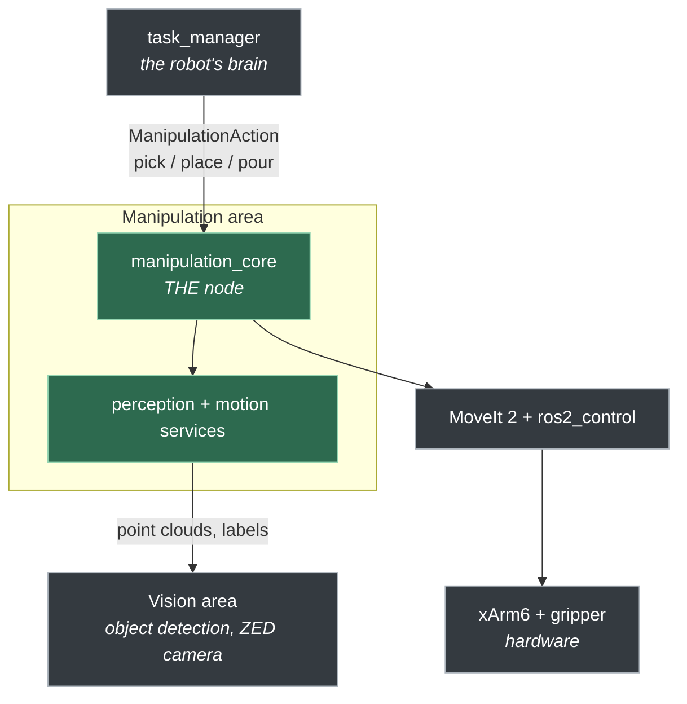
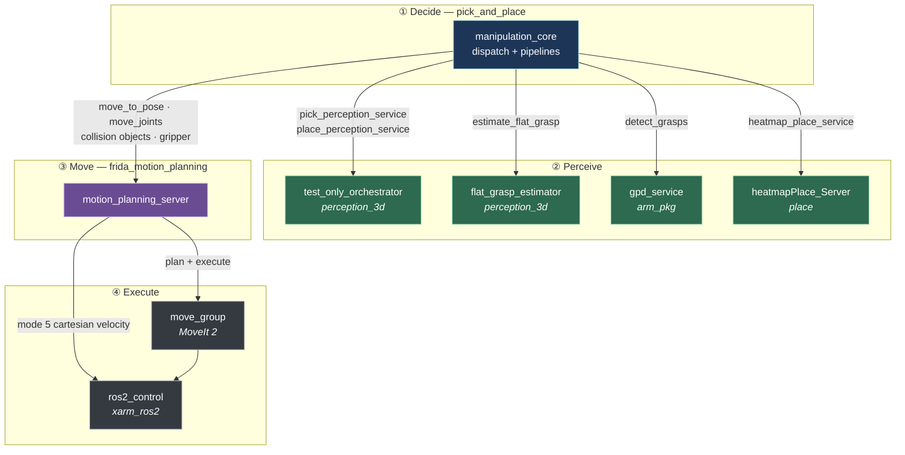
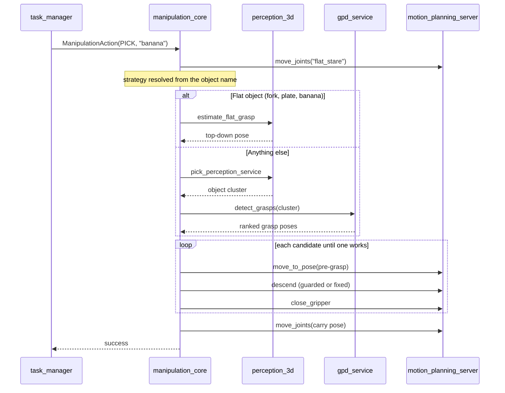

# Manipulation

Everything the robot does with its arm: **pick**, **place**, **pour**, and the perception and motion
services those three need. One ROS 2 action is the whole public surface; everything below it is an
implementation detail of this area.

> Simulation packages (`mujoco_spawn`, `mujoco_ros2_control`) are out of scope here — they are not
> part of the pick-and-place path.

---

## 1. System context

Who talks to manipulation, and what manipulation talks to.



The contract with the rest of the robot is exactly one action:

```
/manipulation/manipulation_action_server   (frida_interfaces/action/ManipulationAction)
```

| `task_type` | Value | What it does |
|---|---|---|
| `PICK` | 0 | Find an object and grasp it |
| `PICK_CLOSEST` | 1 | **Not implemented** — fails loudly |
| `PLACE` | 2 | Put down what is held |
| `POUR` | 3 | Pour a held/grasped container into another |

A `place` is only meaningful after a `pick` or `pour` **in the same process**: the node remembers the
last pick outcome and uses its measured object height to decide the drop height.

---

## 2. The packages

Only what the pick-and-place path uses.

### Ours (`manipulation/packages/`)

| Package | Runs | Responsibility |
|---|---|---|
| **`pick_and_place`** | `manipulation_core`, `keyboard_input`, `fix_position_to_plane` | The pipelines. Decides *what* to do |
| **`frida_motion_planning`** | `motion_planning_server` | The only node that commands the arm. Decides *how* to move |
| **`perception_3d`** | `test_only_orchestrator`, `pick_primitives`, `plane_service`, `flat_grasp_estimator`, `downsample_pc` | Segments objects and surfaces from the point cloud |
| **`place`** | `heatmapPlace_Server` | Scores a surface and returns the best free spot |
| **`arm_pkg`** | `gpd_service` | Wraps the GPD library; also owns the MoveIt launch files |
| **`manipulation_general`** | `manipulation_safeguard` | Task launch files (`ppc`, `gpsr`, …); watches the xArm state and clears errors / re-enables motion |
| **`frida_pymoveit2`** | *(library)* | xArm6 joint names and `JOINT_POSITION_LIMITS` |
| **`xarm_utils`** | *(library)* | Shelf level geometry |
| **`vamp_moveit_plugin`** | *(MoveIt plugin)* | VAMP planner, with OMPL fallback |
| **`xarm6_ikfast_plugin`** | *(MoveIt plugin)* | Analytical IK for the xArm6 |

### Submodules — pull before building

`gpd` · `pymoveit2` · `vamp` · `xarm_ros2`

```bash
git submodule update --init --recursive manipulation/packages/
```

### Shared, outside `manipulation/`

| Path | What |
|---|---|
| `frida_interfaces/manipulation/` | Every `.msg` / `.srv` / `.action` used here |
| `frida_constants/` | Service and topic names, object name sets, arm configurations |
| `robot_description/frida_description/` | URDF and the MoveIt scene |

---

## 3. Architecture

Four layers. An arrow crosses a layer boundary only downward.



**The rule that keeps this readable:** the pipelines never create a ROS client. They call
`RobotArm` and `Perception` (in `pick_and_place/robot/`), and those two own every service and action
client in the area. A unit test enforces it.

### Two ways to reach the arm

`motion_planning_server` is the only node that commands hardware, but it does so through **two very
different paths**, and knowing which one is active explains most failures:

| | Path A — MoveIt | Path B — cartesian velocity |
|---|---|---|
| xArm mode | **1** | **5** |
| Used by | every `move_to_pose` / `move_joints` | force-guarded and fixed-distance descents |
| Collision checking | yes, full planning scene | **none** |
| Stops on e-stop | via the controller | only because the pipeline polls it |

Mode 5 takes the trajectory controller offline. The code always restores mode 1 on the way out; if a
descent crashes without restoring it, every later plan fails until the arm is reset.

---

## 4. What actually runs

```
ros2 launch manipulation_general ppc.launch.py
│
├── arm_pkg/frida_moveit_config.launch.py
│   ├── frida_moveit_common.launch.py ──> move_group          (MoveIt 2)
│   ├── joint_state_publisher
│   └── controller spawners ────────────> ros2_control        (xarm_ros2)
│
└── pick_and_place/pick_and_place.launch.py
    ├── gpd_service                 (arm_pkg)      respawns after every call
    ├── manipulation_core           (pick_and_place)
    ├── perception_3d.launch.py ──> test_only_orchestrator, pick_primitives, plane_service
    ├── heatmapPlace_Server         (place)
    ├── motion_planning_server      (frida_motion_planning)
    ├── manipulation_safeguard      (manipulation_general)
    ├── fix_position_to_plane       (pick_and_place)
    └── flat_grasp_estimator        (perception_3d)
```

> **Naming trap:** `test_only_orchestrator` is **not** test-only. It serves
> `pick_perception_service` and `place_perception_service` — segmenting the object cluster and the
> place surface. Without it, every pick and place fails at perception.

---

## 5. A pick, end to end



### The five pick strategies

Chosen by object name in `pipelines/classification.py`; tuned in `config/pick_profiles.yaml`.

| Strategy | For | Motion |
|---|---|---|
| `flat` | forks, plates, sponges | Descend until **joint effort** reports contact |
| `rim` | baskets | Descend a fixed distance, straddling the rim |
| `bowl` | bowls | Same, shorter descent |
| `peak` | clothes piles | Same, onto the highest point |
| `gpd` | **everything else** | Plan straight to a GPD grasp, no descent |

Retuning any number is a YAML edit. Adding a behaviour that reuses an existing motion is a YAML entry
plus two lines. Only a genuinely new motion needs a new class.

---

## 6. Key interfaces

| Name | Provider | Used for |
|---|---|---|
| `/manipulation/manipulation_action_server` | `manipulation_core` | **The** entry point |
| `/manipulation/move_to_pose_action_server` | `motion_planning_server` | Any cartesian goal |
| `/manipulation/move_joints_action_server` | `motion_planning_server` | Named poses and joint goals |
| `/manipulation/pick_perception_service` | `test_only_orchestrator` | Object cluster |
| `/manipulation/place_perception_service` | `test_only_orchestrator` | Place surface cloud |
| `/manipulation/estimate_flat_grasp` | `flat_grasp_estimator` | Top-down pose for flat objects |
| `/manipulation/detect_grasps` | `gpd_service` | GPD grasp candidates |
| `/manipulation/heatmap_place_service` | `heatmapPlace_Server` | Best free spot on a surface |
| `/manipulation/estop` | *(topic)* | Aborts any motion in progress |

Names are constants in `frida_constants` (`manipulation_constants.py` / `..._cpp.hpp`) — never
hardcode them.

---

## 7. Where to change what

| I want to… | Touch |
|---|---|
| Retune a descent, force, speed or height | `pick_and_place/config/pick_profiles.yaml` |
| Make an object use another strategy | `frida_constants/manipulation_constants.py` (name sets) |
| Change *what* a pick/place/pour does | `pick_and_place/pipelines/` |
| Change *how* the arm moves | `pick_and_place/robot/arm.py` |
| Change where a place lands | `place/scripts/heatmapPlace_Server.py` |
| Change object/surface segmentation | `perception_3d/` |
| Add a named arm pose | `frida_constants/xarm_configurations.py` |
| Add a message, service or action | `frida_interfaces/manipulation/` |

---

## 8. Running it

### Build

```bash
./run.sh manipulation --build     # builds inside the container
```

Submodules must be initialised first (§2). Inside the container the workspace is `/workspace`, with
the repository mounted at `/workspace/src`.

### Launch

```bash
ros2 launch manipulation_general ppc.launch.py     # pick, place, carry
```

Other entry points in `manipulation_general/launch/`: `gpsr`, `restaurant`, `receptionist`, `carry`,
`hric`.

### Drive it by hand

```bash
ros2 run pick_and_place keyboard_input.py
```

A menu for pick / place / pour and the shelf helpers — the fastest way to test one behaviour without
the task manager.

### Tests

```bash
cd /workspace/src/manipulation/packages/pick_and_place
python3 -m pytest test/ -q
```

Fakes only, no ROS graph and no hardware. They pin decisions, not geometry: a green run says the
logic still makes the same choices, **not** that the robot works.

---

## 9. Debugging

Read the logs in this order — each line tells you which layer failed:

```
[flat pose=0 alt=1] descend: start        <- manipulation_core, phase + candidate
[ForceGuard] t=6.0s ~72mm max_jump=0.44N  <- the descent, live effort
[ompl] Unable to sample any valid states  <- MoveIt: goal unreachable or in collision
```

| Symptom | Look at |
|---|---|
| `grasp pose unreachable`, OMPL cannot sample | Collision scene. The octomap often contains the target object |
| Descent stops short | `[ForceGuard]` trace: a false contact trips near `min_contact_descent` |
| `no contact after descending N mm` | Budget is `timeout × descent_speed`; compare with the real height |
| Everything fails after one bad run | The arm may be stuck in mode 5. Check `[xArm] mode …` lines |
| Place lands in a strange spot | `heatmapPlace_Server` publishes its chosen point and can dump its maps |

```bash
docker compose -f docker-compose-l4t.yaml exec -T manipulation \
  bash -c "source /opt/ros/humble/setup.bash && ros2 node list"
```

---

## 10. Docker setup

**Requirements:** Docker Engine, and the NVIDIA Container Toolkit for CUDA/L4T images.

```bash
git clone https://github.com/RoBorregos/home2
cd home2
./run.sh manipulation            # base image + manipulation image + container
./run.sh manipulation --build    # also runs colcon inside
```

The image is picked automatically: `cpu`, `cuda` (desktop with NVIDIA) or `l4t` (Jetson). The
repository is mounted, so edits on the host are visible inside without rebuilding.

To rebuild the image:

```bash
./run.sh manipulation --build-image
```

> `--clean` removes `build/`, `log/` and `install/` **from the repository root**, where they do not
> exist — the real build tree lives in `docker/manipulation/`. Delete that one by hand when a stale
> CMake cache bites (typically after switching branches).
