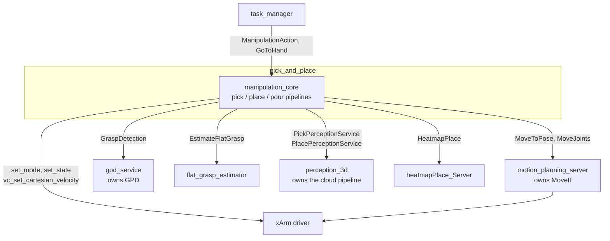
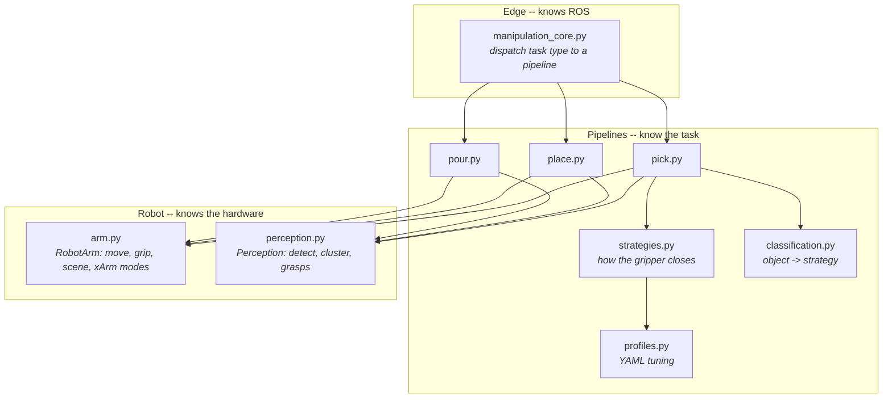

# Pick and Place

The manipulation task layer. One node, `manipulation_core`, accepts a task (pick, place, pour),
runs it start to finish, and reports success. It owns no motion planning and no perception of its
own -- it drives the nodes that do.

## External contract

Everything outside this package talks to it through exactly three interfaces. They are stable;
nothing else here is public.

| Interface | Type | Used by |
|---|---|---|
| `/manipulation/manipulation_action_server` | `ManipulationAction` | `task_manager` (pick / place / pour / place_on_shelf / place_in_point), `keyboard_input.py`, `pick_benchmark.py`, `manipulation_client.py` |
| `/manipulation/go_to_hand_action_server` | `GoToHand` | `task_manager` (handover) |
| `/manipulation/fixed_distance_move` | `FixedDistanceMove` | `task_manager` (`move_arm_vertical`) |

## System context

A node exists here only if it owns expensive state. MoveIt, GPD and the point-cloud pipeline each
do; the pick, place and pour flows do not, so they are functions in one node rather than three.



The arm is driven two ways. Normal motion goes through `motion_planning_server` and MoveIt. The
descents bypass it: they switch the xArm into cartesian-velocity mode (mode 5) and close the loop
themselves, because MoveIt cannot plan into a basket the octomap has filled with noise. Mode 5 takes
the trajectory controller offline, so it is always entered through a context manager that restores
mode 1 on the way out.

## Package architecture

Three layers, each with a strict rule about what it may know.



| Layer | May know | Must not |
|---|---|---|
| `manipulation_core.py` | ROS: action servers, goal handles, parameters | manipulation logic |
| `pipelines/*.py` | the task, start to finish | ROS clients — call `arm.*` / `perception.*` only |
| `robot/*.py` | MoveIt, xArm, the gripper, the planning scene | which task is running |

The middle rule is enforced by a test (`test_fakes.py::test_pipelines_do_not_import_ros_clients`),
because it is the rule that erodes first.

## Tree structure

```
pick_and_place/
├── config/
│   └── pick_profiles.yaml       every tuned number, per pick strategy
├── launch/
│   └── pick_and_place.launch.py brings up the whole manipulation stack
├── pick_and_place/
│   ├── manipulation_core.py     THE node: action servers + task dispatch
│   ├── pipelines/
│   │   ├── pick.py              stare -> perceive -> strategy -> return
│   │   ├── place.py             choose a pose -> reach it -> release -> return
│   │   ├── pour.py              find container -> grasp source -> tilt -> return
│   │   ├── strategies.py        the 3 grasp motions + the STRATEGIES table
│   │   ├── classification.py    object_name -> strategy key
│   │   ├── profiles.py          YAML loading, override and validation
│   │   └── errors.py            PickAttemptFailed / PickAborted / PickHardwareError
│   ├── robot/
│   │   ├── arm.py               RobotArm -- everything the robot can do
│   │   ├── perception.py        Perception -- everything it can see
│   │   └── geometry.py          pose maths
│   ├── utils/                   grasp + collision helpers shared with perception_3d
│   ├── keyboard_input.py        operator TUI
│   ├── pick_benchmark.py        success-rate harness
│   ├── manipulation_client.py   RViz clicked-point bridge
│   └── fix_position_to_plane.py separate node: where to stand for a surface
└── test/
```

## How a pick runs

`pipelines/pick.py::execute` is four steps; each is a function directly below it in the same file.

1. **Look** — `_move_to_stare_pose` moves to the named pose for this strategy
   (`STARE_POSES`, defaulting to `table_stare`).
2. **Perceive** — `_perceive` splits two ways. Flat, rim, bowl and peak objects ask
   `flat_grasp_estimator` for one top-down pose (`_perceive_flat`); it deliberately does *not*
   cluster, because clustering adds the table as an obstacle and MoveIt then rejects every
   near-table path. Everything else is detected, clustered and measured (`_perceive_cluster`).
3. **Grasp** — `_grasp_sets` yields batches of candidates: one batch from the estimator, or one per
   GPD config so an unreachable config falls back to the next. `_run_strategy` applies the tip
   offset along the gripper's approach axis, then hands each candidate to the strategy until one
   succeeds.
4. **Return** — `_return_to_carry_pose`. Shelf picks retract to `front_stare` first; rim picks hold
   position (a basket is carried where it was grasped); everything else returns to a stare pose.

The gripper opens *after* perceiving and *before* grasping — the fingers are in the camera's view
while it looks.

Failures are typed, and the caller decides what each one means:

| Raised | Means | Executor does |
|---|---|---|
| `PickAttemptFailed` | this candidate did not work | try the next candidate |
| `PickHardwareError` | mode switch or service fault | stop; the robot state is unknown |
| `PickAborted` | e-stop or goal cancellation | stop immediately, restore mode 1 |

## Pick strategies

Which strategy runs is decided by `classification.resolve_pick_strategy(object_name)`. Order
matters there: `bowl` is a member of `RIM_NAMES`, so it is tested first.

| Profile | Objects | Class | How it grasps |
|---|---|---|---|
| `flat` | fork, knife, spoon, cutlery, plate, red_plate, toothpaste, sponge, dishwasher_tab | `ForceGuardedDescentPick` | Descends until joint effort jumps. A fixed descent onto a 3 mm object either stops short or drives into the table. |
| `rim` | basket, laundry_basket | `FixedDistanceDescentPick` | Straddles the rim; fingers close around the wall. |
| `bowl` | bowl | `FixedDistanceDescentPick` | Same motion, much shorter descent. |
| `peak` | clothes | `FixedDistanceDescentPick` | Descends onto the highest content in a cavity. |
| `gpd` | anything else | `DirectGraspPick` | Plans straight to a GPD grasp. The only strategy that attaches the object in the planning scene, and so the only one that reports object heights to `place`. |

Rim, bowl and peak are one algorithm with three parameter sets. The descent distance is always
`pre_grasp_height - grasp_z_tweak`:

| | pre_grasp_height | grasp_z_tweak | descent |
|---|---|---|---|
| rim | 0.10 | −0.05 | **0.15 m** |
| bowl | 0.10 | 0.02 | **0.08 m** |
| peak | 0.15 | 0.00 | **0.15 m** |

## Configuration

Every tuned number lives in [`config/pick_profiles.yaml`](config/pick_profiles.yaml) — pre-grasp
heights, descent distances and speeds, gripper settle times, and the flat strategy's contact-force
thresholds. Retuning is a YAML edit, not a code change.

Three ways to override, in order of precedence:

```bash
# 1. one field, at launch or on the command line
ros2 run pick_and_place manipulation_core.py \
  --ros-args -p pick_profile.flat.force_guard.jump_trip:=3.0

# 2. a whole alternative file
export FRIDA_PICK_PROFILES_FILE=/path/to/my_profiles.yaml

# 3. edit the installed config/pick_profiles.yaml
```

Profiles are loaded and **validated at startup**, so a bad value fails at launch rather than
mid-descent with the arm in cartesian-velocity mode. Validation catches unknown and missing keys,
wrong types, a descent that resolves non-positive, a `jump_trip` above the hard ceiling, and a
force-guard timeout too short to cover the pre-grasp height.

The tip offsets stay ROS parameters because they are physical properties of the gripper:
`ee_link_offset` (−0.09 in the launch file), `rim_tip_offset`, `bowl_tip_offset`.

## Adding or tuning a pick behavior

- **Retune an existing behavior** — edit `pick_profiles.yaml`. No code, no rebuild.
- **New behavior, existing motion** — add a profile to the YAML, add its key to
  `classification.PICK_STRATEGY_KEYS` and `_STRATEGY_BY_OBJECT_NAME`, and add one line to
  `strategies.STRATEGIES` pointing at the class that serves it.
- **New motion algorithm** — add one class to `strategies.py` implementing
  `attempt(arm, candidate) -> PickOutcome`, then register it as above. It may only use `RobotArm`
  methods; if you need something the arm cannot do, add it to `robot/arm.py` first.

A profile whose key has no registered class fails at startup, not on the first pick of that type.

## Running

```bash
ros2 launch pick_and_place pick_and_place.launch.py                  # real robot
ros2 launch pick_and_place pick_and_place.launch.py use_sim_time:=true

ros2 node list     # expect ONE manipulation node: /manipulation_core
ros2 action list   # ManipulationAction + GoToHand only
```

Operator tools:

```bash
ros2 run pick_and_place keyboard_input.py                      # menu-driven pick/place/pour
ros2 run pick_and_place pick_benchmark.py --mode flat --trials 10
ros2 run pick_and_place manipulation_client.py                 # pick an RViz clicked point
```

Live phase state is published as action feedback (`execution_state`), e.g. `flat pose=0 alt=2/descend`.

## Testing

```bash
colcon build --symlink-install --packages-select frida_constants frida_interfaces pick_and_place
colcon test --packages-select pick_and_place && colcon test-result --verbose
```

No ROS graph and no hardware: the pipelines run against `FakeArm` / `FakePerception`. The suite
covers object classification, profile loading and validation, each strategy's exact call sequence,
the descent arithmetic above, candidate iteration and retry, abort propagation, and the layering
rule. `test/conftest.py` stubs sibling ROS packages *only* when they are not built, so a full
workspace tests against the real ones.

Because `RobotArm` is a plain class rather than an ABC, `test_fakes.py` asserts by introspection
that `FakeArm` still covers its public surface — that is what stops the fakes drifting.

## Status

This package was recently restructured: four nodes (`manipulation_core`, `pick_server`,
`place_server`, `pour_server`) merged into one, and the `PickMotion` / `PlaceMotion` / `PourMotion`
actions were deleted — they had no callers outside this package and only added process hops.

**Verified:** unit tests, lint, format, and import checks over every module.
**Not yet verified on hardware.** Outstanding checks, in priority order:

1. Concurrency — run a pick, a place and a `go_to_hand` close together and confirm no callback
   starves. The merged node runs `MultiThreadedExecutor(16)` with everything on one reentrant
   callback group; a client landing on the default group would deadlock.
2. `flat_stare` now serves *all* flat objects, where plates and sponges previously used
   `table_stare`. It is a noticeably different arm configuration, so confirm the flat-grasp
   estimator still detects the larger flat items from it.
3. Mode recovery — after a deliberately failed descent and after an e-stop mid-descent, confirm the
   arm reports mode 1.
4. `PickOutcome.object_pick_height` is non-zero after a rim/bowl/peak pick, and a following place
   succeeds. This was a live bug before the restructure.
