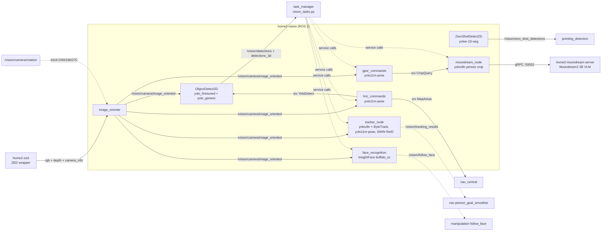

# Vision

Vision turns the ZED's RGB-D stream into everything the task managers need to reason about
the world: object detections with 3D points, people with poses, gestures and clothing
colors, known faces, a tracked person to follow, and free-form visual questions answered by
a VLM. It runs on `ROS 2` (Humble) inside a single `home2-vision` container, plus one
non-ROS sidecar — `home2-moondream-server` — that serves the Moondream2 VLM over `gRPC`.

> Vision **does not own the camera**. Frames come from the separate `home2-zed` container
> (`./run.sh zed`, Jetson/Orin only) or, on a laptop, from `zed_simulator.py` publishing a
> plain webcam onto the same topics.

## Tree structure

```bash
home2/
│
│frida_constants/                          # Shared constants for the project
├── frida_constants/
│   ├── vision_constants.py                # Every camera/topic/service name (the authority)
│   ├── vision_classes.py                  # BBOX, ShelfDetection dataclasses
│   └── vision_enums.py                    # Gestures, Poses, DetectBy
│
│frida_interfaces/                         # Custom ROS interfaces
├── vision/
│   ├── action/                            # DetectPerson, Xarmmove
│   ├── msg/                               # ObjectDetection(+Array), Detection, Person,
│   │                                      # PersonList, CustomerTable, Point2D, Shelf*
│   └── srv/                               # 30 services (Query, FindSeat, TrackBy, ...)
│
│vision/
├── packages/
│   ├── object_detector_2d/                # 2D detection + 3D deprojection backbone
│   │   ├── config/
│   │   │   ├── parameters.yaml            # ObjectDetect2D params
│   │   │   └── parameters_zero_shot.yaml  # ZeroShotDetect2D params
│   │   ├── launch/
│   │   │   ├── object_detector_node.launch.py       # image_orienter + ObjectDetect2D
│   │   │   ├── zero_shot_object_detector_node.launch.py
│   │   │   └── object_detector_combined.launch.py   # both detectors at once
│   │   ├── models/                        # Custom weights (robocup2026_v1.pt, tmr2025.pt)
│   │   └── scripts/
│   │       ├── base_detector_node.py      # Shared base: params, TF, 3D projection, markers
│   │       ├── object_detector_node.py    # Runs N YOLO models, IoU-dedupes across them
│   │       ├── zero_shot_object_detector_node.py    # YOLOE open-vocabulary detector
│   │       ├── vision_3D_utils.py         # Pixel -> 3D point helpers
│   │       └── detectors/                 # Pluggable model layer
│   │           ├── base.py                # BBOX, Detection, DetectorModel ABC
│   │           ├── registry.py            # MODEL_CONFIGS catalog + singleton loader
│   │           ├── yolo.py                # @register("yolo") — v8/v11/v26
│   │           ├── yolo_e.py              # @register("yolo_e") — YOLOE zero-shot
│   │           └── robocup2026_translation.json     # Raw label -> published label
│   │
│   ├── vision_general/                    # People, tracking and the per-task command nodes
│   │   ├── config/botsort-reid.yaml       # Ultralytics BoT-SORT tracker config
│   │   ├── launch/                        # One launch file per competition task
│   │   │   ├── hric_launch.py
│   │   │   ├── gpsr_launch.py
│   │   │   ├── ppc_launch.py
│   │   │   ├── dlc_launch.py
│   │   │   └── restaurant_launch.py
│   │   ├── scripts/                       # ROS nodes (see Packages below)
│   │   └── vision_general/utils/          # Importable library shared by every node
│   │       ├── calculations.py            # deproject_pixel_to_point, get_depth, centroids
│   │       ├── trt_utils.py               # load_yolo_trt(): .pt -> cached TensorRT .engine
│   │       ├── debug_pub.py               # Subscriber-gated, rate-limited debug images
│   │       ├── area_check.py              # Room filtering via nav MapAreas + TF
│   │       ├── reid_model.py              # SWIN person re-identification embedder
│   │       └── models/swin/               # ReID network
│   │
│   └── moondream_run/                     # Moondream2 VLM bridge
│       ├── scripts/moondream_node.py      # ROS node; gRPC client to localhost:50052
│       └── moondream_server/              # Runs in its OWN container, not the ROS one
│           ├── server.py                  # gRPC server on port 50052
│           ├── moondream_lib.py           # HF vikhyatk/moondream2 wrapper
│           └── moondream_proto.proto      # service MoonDreamService
│
├── requirements/                          # pip sets consumed by docker/vision/Dockerfile.*
│   ├── opencv.txt                         # numpy pin (opencv-python is forbidden on L4T)
│   ├── torch.txt / torch-gpu.txt          # CPU vs cu118 torch pins
│   ├── models.txt                         # ultralytics, lap
│   ├── face_recognition.txt               # insightface
│   ├── utils.txt                          # tqdm, pillow, timm
│   └── moondream.txt / moondream_server.txt
│
├── scripts/
│   └── fetch_models.py                    # Offline model provisioning + TRT warmup
│
└── README.md                              # This file
│
docker/vision/                             # Images, compose and the area entrypoint
├── Dockerfile.{cpu,cuda,l4t}              # ROS container (builds iceoryx + CycloneDDS SHM)
├── Dockerfile.moondream.server            # VLM sidecar
├── docker-compose.yaml                    # include: vision-general.yaml + moondream.yaml
├── vision-general.yaml                    # service `vision`      -> home2-vision
├── moondream.yaml                         # service `moondream-server` (port 50052)
├── trt_cache/                             # Persisted weights + TensorRT engines
└── run.sh                                 # Area entrypoint (called by root run.sh)
```

## Concepts

**Camera orientation is centralized.** FRIDA's camera is not always upright, so exactly one
node applies rotation: `image_orienter` subscribes to `CAMERA_TOPIC` and
`CAMERA_ROTATION_TOPIC` (an `Int16` of 0/90/180/270) and republishes on
`IMAGE_ORIENTED_TOPIC`. Every downstream node consumes the *oriented* topic. A launch file
must therefore never start two `image_orienter` instances — the per-task launches that
`include` `object_detector_node.launch.py` deliberately do not declare their own.

**Detectors are a plugin registry, not hardcoded models.**
`object_detector_2d/scripts/detectors/registry.py` holds `MODEL_CONFIGS`:

| Name | Weights | Type | conf |
| --- | --- | --- | --- |
| `yolo_finetuned` | `robocup2026_v1.pt` | `yolo` | 0.6 |
| `yolo_generic` | `yolo26n.pt` | `yolo` | 0.5 |
| `zero_shot` | `yoloe-11l-seg.pt` | `yolo_e` | 0.25 |

Adding a model with the same architecture is a two-step change: drop the `.pt` beside
`registry.py` and add one dict entry. A model with conflicting dependencies, or one needing
more than ~4 GB of exclusive GPU, should become a new gRPC container in `docker/vision/`
instead — that is exactly what `moondream_run` is.

**2D boxes become 3D points in the base class.** `base_detector_node.py` pairs each
detection with `DEPTH_IMAGE_TOPIC` and `CAMERA_INFO_TOPIC`, deprojects the box centroid via
`vision_general/utils/calculations.py`, transforms it out of `CAMERA_FRAME` with TF, and
publishes both `ObjectDetectionArray` and RViz markers.

**TensorRT engines are built, cached, and device-specific.**
`utils/trt_utils.py::load_yolo_trt` exports a `.pt` to a `.engine` on first use and caches
it in `TENSORRT_CACHE_DIR` (`docker/vision/trt_cache`, a persistent mount).
**Never copy engines between the laptop and the Orin** — they are tied to the device and the
TensorRT version. Set `use_trt: False` when working on a PC.** 

**Weights are provisioned up front, on purpose.** `.pt` files are gitignored and download
lazily on a node's first run, followed by minutes of TRT export. On competition day, with no
internet, a fresh container simply breaks. `vision/scripts/fetch_models.py` fetches every
standard weight, verifies the custom ones, writes a `MANIFEST.json` of sha256 hashes, and
with `--warmup` pre-builds every engine for *this* device. Run it before you go offline:

```bash
./run.sh vision --warmup
```

## Vision pipeline



## Packages

### `object_detector_2d`

The detection backbone. Both nodes share `BaseDetectorNode`, which declares the camera
topics, `TARGET_FRAME`, `DEPTH_ACTIVE`, `FLIP_IMAGE` and `MAX_DEPTH_THRESH` parameters and
handles projection and visualization.

| Node | Purpose | Key interfaces |
| --- | --- | --- |
| `ObjectDetect2D` | Runs every model in `MODEL_CONFIGS` continuously and IoU-dedupes across them | pubs `/vision/detections`, `/vision/detections_3d`, `/vision/detections_image`; srvs `DetectionHandler`, `YoloDetect`, `SetTrashCategory` |
| `ZeroShotDetect2D` | YOLOE open-vocabulary detection for classes not in the finetuned model | pubs `/vision/zero_shot_detections*`; srv `SetDetectorClasses` |

Each node has a fixed activation topic (`/vision/object_detector/active`,
`/vision/zero_shot_detector/active`) so a task manager can idle the GPU between steps.

### `vision_general`

| Node | Purpose | Key interfaces | Model |
| --- | --- | --- | --- |
| `hric_commands` | Person detection, seat finding, handover point, chair removal | action `DetectPerson`; srvs `FindSeat`, `DetectHand`, `ChairsToRemove` | yolo11m-pose |
| `gpsr_commands` | Counting and describing people by pose, gesture, clothing color | srvs `CountByPose`, `CountBy`, `CountByColor`, `PersonPoseGesture` | yolo11m-pose |
| `tracker_node` | Locks onto one person and publishes their 3D point for nav to follow | srvs `SetBool`@`set_tracking_target`, `TrackBy`, `Trigger`@`is_tracking`; pub `/vision/tracking_results` | yolov8n + ByteTrack, yolo11m-pose, SWIN ReID |
| `face_recognition` | Learns and recognizes faces; drives the arm's face following | srvs `SaveName`@`new_name`, `SaveName`@`follow_by_name`; pubs `/vision/follow_face`, `/vision/person_list` | InsightFace `buffalo_sc` |
| `restaurant_commands` | Maps waving customers onto table positions | srv `CustomerTables` | — (delegates) |
| `customer_node` | Finds seated / waving customers in the full frame | srv `Customer` | yolo11m-pose |
| `image_orienter` | The single camera-rotation point (see Concepts) | pub `/vision/camera/image_oriented` | — |
| `pointing_detection` | Resolves which object a person is pointing at | srvs `DetectPointingObject`, `SetPointingObjectClasses` | consumes zero-shot |
| `zed_simulator` | Publishes a plain webcam onto the ZED topics for laptop dev | params `video_id`, `use_zed`, `visualize` | — |

`pose_detection.py` is a library, not a node: it holds the COCO keypoint constants and the
gesture/pose classification used by `hric_commands`, `gpsr_commands` and `customer_node`.

### `moondream_run`

`moondream_node` is a thin ROS ⇄ gRPC bridge. The model itself lives in a separate container
because its dependency set conflicts with the ROS one.

| ROS service | Type | Does |
| --- | --- | --- |
| `/vision/query` | `Query` | Free-form question about the current frame |
| `/vision/crop_query` | `CropQuery` | Same, restricted to a bounding box |
| `/vision/beverage_location` | `BeverageLocation` | Locates a named drink |
| `/vision/object_points` | `ObjectPoints` | 2D points for a described subject |
| `/vision/moondream_detection` | `MoondreamDetection` | Open-vocabulary detection (normalized bboxes) |
| `/vision/person_posture` | `PersonPosture` | Describes a person's posture |

The gRPC side (`MoonDreamService` on port `50052`) exposes `EncodeImage`, `FindBeverage`,
`FindObjectPoints`, `Query` and `Detect`, backed by `vikhyatk/moondream2`.


## Running vision

Each competition flag maps to one launch file and one set of compose profiles:

| Command | Launch file | Extra container |
| --- | --- | --- |
| `./run.sh vision` | *(interactive shell)* | — |
| `./run.sh vision --hric` | `vision_general hric_launch.py` | moondream |
| `./run.sh vision --gpsr` | `vision_general gpsr_launch.py` | moondream |
| `./run.sh vision --ppc` | `vision_general ppc_launch.py` | moondream |
| `./run.sh vision --restaurant` | `vision_general restaurant_launch.py` | moondream |
| `./run.sh vision --dlc` | `vision_general dlc_launch.py` | — |
| `./run.sh vision --moondream` | *(VLM server only)* | moondream |
| `./run.sh vision --warmup` | *(runs `fetch_models.py --warmup`)* | — |

What each launch file starts:

| Launch file | Nodes |
| --- | --- |
| `hric_launch.py` | `face_recognition`, `hric_commands`, `moondream_node`, `image_orienter`, `ObjectDetect2D`, `tracker_node` |
| `gpsr_launch.py` | `hric_commands`, `gpsr_commands`, `face_recognition`, `tracker_node`, `moondream_node` + the detector launch |
| `ppc_launch.py` | `hric_commands`, `moondream_node` + the detector launch |
| `restaurant_launch.py` | `restaurant_commands`, `customer_node`, `moondream_node` + the detector launch |
| `dlc_launch.py` | the detector launch only (`image_orienter` + `ObjectDetect2D`) |

Modifier flags, combinable with any of the above:

```bash
./run.sh vision --build          # colcon build before launching
./run.sh vision --hric --build   # the usual first-of-the-day command
./run.sh vision --build-image    # rebuild the docker image
./run.sh vision --recreate       # docker compose down, then up (network/.env changes)
./run.sh vision --stop           # stop containers, keep them
./run.sh vision --down           # stop and remove
./run.sh vision --clean          # delete build/, install/, log/
```

### Building inside the container

`--build` runs exactly this — `frida_interfaces` and `frida_constants` are ignored because
they come prebuilt from the shared cache container (`./run.sh frida_interfaces`):

```bash
colcon build --packages-ignore frida_interfaces frida_constants \
  --packages-up-to vision_general object_detector_2d moondream_run
source install/setup.bash
```

Every `scripts/*.py` is installed as an executable, so any script can be run directly:

```bash
ros2 run vision_general tracker_node.py
ros2 run object_detector_2d object_detector_node.py
```

### Camera

On the Orin, start the ZED container (or the wrapper directly):

```bash
./run.sh zed
ros2 launch zed_wrapper zed_camera.launch.py camera_model:=zed2 publish_tf:=false
```

Anywhere else, publish a webcam onto the same topics. `video_id` is the `/dev/videoN` index:

```bash
ros2 run vision_general zed_simulator.py --ros-args -p video_id:=1
```

### Example calls

```bash
# Track the largest person, then stop
ros2 service call /vision/set_tracking_target std_srvs/srv/SetBool "{data: true}"
ros2 service call /vision/set_tracking_target std_srvs/srv/SetBool "{data: false}"

# Track by gesture / pose / clothing color
ros2 service call /vision/set_tracking_target_by frida_interfaces/srv/TrackBy \
    "{track_enabled: true, track_by: 'gestures', value: 'waving'}"
ros2 service call /vision/set_tracking_target_by frida_interfaces/srv/TrackBy \
    "{track_enabled: true, track_by: 'poses', value: 'standing'}"
ros2 service call /vision/set_tracking_target_by frida_interfaces/srv/TrackBy \
    "{track_enabled: true, track_by: 'color', value: 'red shirt'}"

# Is a target locked?
ros2 service call /vision/is_tracking std_srvs/srv/Trigger

# Save the face in front of the camera
ros2 service call /vision/new_name frida_interfaces/srv/SaveName "{name: 'oscar'}"

# Ask the VLM about the frame (needs the moondream profile running)
ros2 service call /vision/query frida_interfaces/srv/Query \
    "{query: 'describe the clothes of the person', person: true}"

# Find an empty seat, count who is standing
ros2 service call /vision/hric/find_seat frida_interfaces/srv/FindSeat "{request: true}"
ros2 service call /vision/gpsr/count_by_pose frida_interfaces/srv/CountByPose \
    "{request: true, pose_requested: 'standing'}"

# Ask the detector for the closest object
ros2 service call /vision/detection_handler frida_interfaces/srv/DetectionHandler \
    "{label: '', labels: [], closest_object: true}"

# Rotate the camera image 180 degrees
ros2 topic pub /vision/camera/rotation std_msgs/msg/Int16 '{data: 180}' -1

# Watch the raw outputs
ros2 topic echo /vision/detections
ros2 topic echo /vision/person_list
ros2 topic echo /vision/tracking_results
```

## Debugging

Debug image topics are **subscriber-gated** by `utils/debug_pub.py`: nothing is encoded
until someone subscribes, so leaving them in costs nothing. Open one in `rqt_image_view`:

| Topic | From |
| --- | --- |
| `/vision/detections_image` | `ObjectDetect2D` |
| `/vision/tracker_image` | `tracker_node` |
| `/vision/face_recognition_image` | `face_recognition` |
| `/vision/hric/img_person_detecion` | `hric_commands` |
| `/vision/gpsr/img_detection` | `gpsr_commands` |

Check which nodes a task expects versus what is actually up:

```bash
./scripts/status.sh vision --gpsr
ros2 node list | grep vision
```

The VLM sidecar logs separately from the ROS container:

```bash
docker logs -f home2-moondream-server
```
## Object detection pipeline training

The training process involves preparing the dataset, configuring the model, and running the training. You can find the pipeline repository [here](https://github.com/RoBorregos/home-pipelines/tree/main/vision/object_detector 
).

## Known issues

These are real inconsistencies in the current tree, recorded so they do not surprise you.
None of them are fixed by this document.

- `./run.sh vision --carry` launches `help_me_carry_launch.py`, which **does not exist**.
- `./run.sh vision --restaurant` builds `object_detection_handler`, a package that **does
  not exist** anywhere in the repo.
- `docker/vision/run.sh` rejects the `cpu` environment (`Unknown environment type!`) even
  though `docker/vision/Dockerfile.cpu` exists.
- `--upload-image` passes `docker-compose.yml`; the real filename is `docker-compose.yaml`.
- Placeholder and typo'd constants in `vision_constants.py`: `DETECTIONS_ACTIVE_TOPIC` and
  `DEBUG_IMAGE_TOPIC` are both `"asd"`, and `SHELF_DETECTION_TOPIC` reads
  `/vision/storing_grocPeries/shelf_detection`.
- `person_in_map.py` imports `PERSON_INSIDE_REQUEST_TOPIC`, which `vision_constants.py`
  never defines — the node fails at import.
- `trash_detection_node.py` is launched by nothing and has no client.
- `auto-complete.sh` does not know the vision-only flags (`--warmup`, `--moondream`,
  `--carry`, `--storing-groceries`).
- `status/configs/vision_nodes.cfg` still refers to `/receptionist_commands`, which is now
  `hric_commands`.
