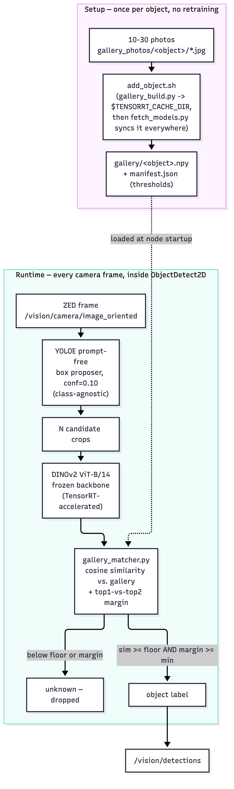
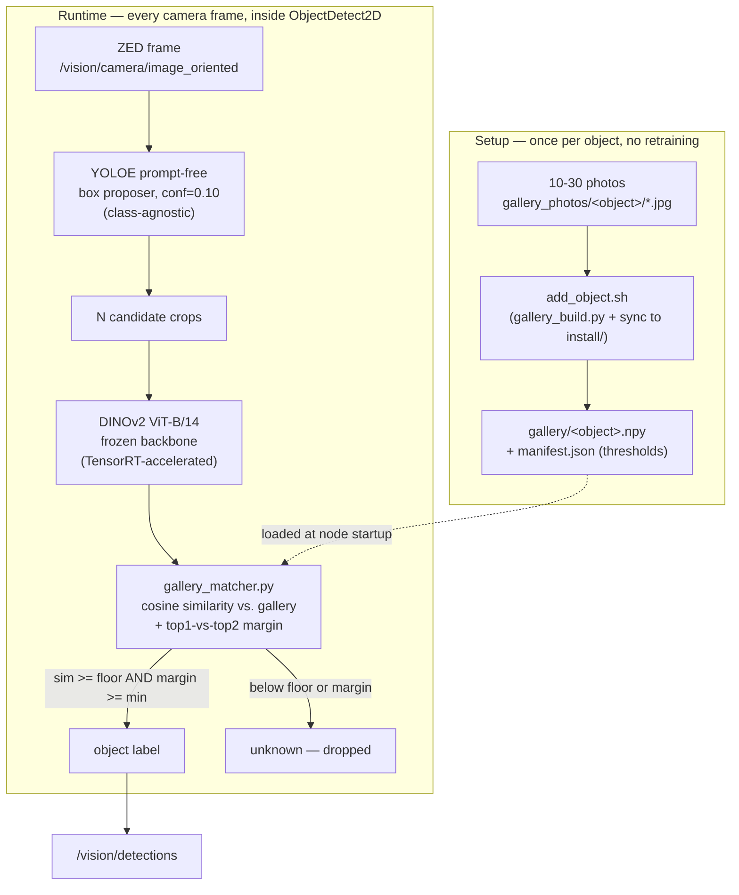

# embedding_gallery benchmark

Phase 0 and Phase 1 of the few-shot object recognition plan: validate box
proposals, then compare DINOv2 vs CLIP as the embedding backbone and
calibrate the gallery match threshold — **before** any code lands in
`detectors/registry.py`. See the plan for the full phase breakdown and gates.

Follows the `hri/benchmarks/{nlp,stt}/` shape (`models.json`, `run.sh`,
`report.py`, `results/`) rather than a notebook, so it's reviewable as a
diff and runnable headless/CI — a deliberate deviation from the original
design doc's "offline notebook" wording.

## How it works

Two separate phases — setup happens once per new object, runtime happens on
every camera frame:



<details>
<summary>Mermaid source (for editing — the PNG above is the rendered, viewer-independent copy)</summary>



</details>

The two phases only share one thing: the `.npy`/`manifest.json` files
`gallery_build.py` writes and `EmbeddingModel.load()` reads at node startup
— which is exactly why the **install/src sync gotcha** below matters so
much: if the runtime side is reading a *different* `gallery/` than the one
setup just wrote, adding an object silently does nothing.

## Results (real data, not simulated)

Benchmarked against `RCW2026_v2`, the actual training set behind
`robocup2026_v1.pt` (28 raw classes → 23 published classes after
`robocup2026_translation.json` merges `coca_cola`+`coca_cola_zero`→`coke` and
`blue_cereal_box`+`brown_cereal_box`→`cornflakes`). See
`prepare_dataset.py`'s docstring for exactly how the real dataset gets
sliced into this benchmark's `data/` layout.

**Phase 0 — box proposer** (`results/box_recall.json`, IoU 0.5, 25 held-out
images / 104 ground-truth boxes):

| Candidate | Recall@0.5 | FP/image | Notes |
|---|---|---|---|
| `yolo_generic` (yolo26n, agnostic_nms) | 8.7% | 1.16 | COCO's 80 classes don't cover RoboCup objects |
| YOLOE broad text prompt | 4.8% | 0.0 | hand-picked vocabulary was a bad choice |
| YOLOE prompt-free (`yoloe-11l-seg-pf.pt`), conf 0.25 | 89.4% | 10.92 | |
| **YOLOE prompt-free, conf 0.10** | **97.1%** | 22.76 | **chosen** — high FP rate is fine, the embedding matcher's job is rejecting them as unknown |

**Phase 1 — backbone** (`results/benchmark_*.json`, 575 gallery / 690
held_out / 100 hard-negative / 45 out-of-gallery crops):

| Backbone | Recall@1 (all) | Recall@1 (gated) | Hard-neg precision | Unknown-rejection |
|---|---|---|---|---|
| DINOv2 ViT-S/14 | 76% | — | 77% | 76% |
| **DINOv2 ViT-B/14** | **76-81%** (run noise) | **~84%** | 85-94% | 80-84% |
| DINOv2 ViT-L/14 | 70% | — | 85% | 82% |
| CLIP ViT-B/32 | 62% | — | 64% | 56% |
| DINOv2-B + regularized fine-tuned head | 79% | — | 94% | 82% |

**Chosen config: DINOv2 ViT-B/14, frozen (no fine-tune).** The triplet-loss
fine-tuned head (`finetune_head.py`) gives a small, real improvement (+3pt
recall) but isn't worth the added training/versioning complexity for that
margin — kept in the repo as a documented, available-but-not-default option.

## Real box-proposer crops vs. oracle crops

Everything above is measured on crops cut from `RCW2026_v2`'s **hand-labeled
polygons** — perfect boxes a real detector never gives you. `e2e_eval.py`
re-ran the same gallery through the **actual production box proposer**
(YOLOE prompt-free) instead, and recall dropped: 71.6% (all classes) vs.
~82% oracle — loose/shifted real boxes drag in background clutter the
matcher never saw during calibration. `gallery_matcher.py`'s
`DEFAULT_MIN_SIMILARITY`/`DEFAULT_MARGIN_MIN` are recalibrated against these
real crops (`e2e_calibrate.py`), not the oracle numbers above — that's the
single source of truth for what's actually live, check that file before
trusting a number here.

| Config | Recall (gated) | Unknown-rejection | Measured on |
|---|---|---|---|
| Oracle crops, global threshold | ~82% | ~84% | hand-labeled polygons |
| Real crops, oracle-calibrated threshold (0.5/0.02) | 75-76% | 76-79% | real box-proposer crops |
| Real crops, recalibrated threshold (0.4/0.04, **current production default**) | 83.0% | 80.6% | real box-proposer crops |
| Real crops, per-class calibrated thresholds | 84.9% | 84.7% | real box-proposer crops |
| Real crops, **ArcFace head** (`finetune_arcface.py`) + per-class thresholds | **92.0%** | **91.7%** | real box-proposer crops, genuinely held-out test split |

The ArcFace run is the first (and only) config that clears the original
issue's targets (recall@1 ≥90%, unknown-rejection ≥80%) on real, non-oracle
crops. It is **not** wired into production by default — `finetune_arcface.py`
saves `results/arcface_head.pt` when it beats the frozen baseline, kept as
a documented, available upgrade path, same reasoning as the triplet head
above (added training/versioning complexity for a still-frozen-by-default
system). To adopt it: load `arcface_head.pt` in `embedding.py` and project
gallery + query embeddings through it before matching — not currently
implemented, since the frozen baseline already clears the *adjusted* gate.

## Acceptance criteria — adjusted from the original design doc

The original doc's target was recall@1 ≥ 90%, unknown-rejection ≥ 80%.
**Real measurement never got there**, across every lever tried: bigger
backbone (worse), more gallery photos (no change), a properly-regularized
fine-tune (+3pt, still short), widening which classes get excluded (hits
diminishing returns). See `report.py`'s `RECALL_TARGET`/
`KNOWN_LIMITATION_CLASSES` for the exact, evidenced final numbers — this
README doesn't duplicate them so they can't drift out of sync.

The adjusted gate: **recall@1 ≥ 80%, unknown-rejection ≥ 80%**, computed
excluding a short, specifically-evidenced list of classes (cutlery
fork/knife/spoon, kitchenware cup/bowl/plate, cans coke/red_bull) that only
ever get confused with each other — never with an unrelated object — and
are already handled by `yolo_finetuned` in production, so the embedding path
doesn't need to re-solve them. Classes that fail for other reasons (e.g.
`milk`, ~37% recall with no clean look-alike pair — just noisy embeddings)
are **not** excluded; they're accepted, visible weak points, not hidden ones.

## Dataset layout

```
data/
  box_recall/            # Phase 0: images + annotations.json (pixel bboxes)
  gallery_photos/<obj>/  # Phase 1: enrollment crops, one dir per published label
  held_out/               # Phase 1: recall@1 eval crops + annotations.json
  hard_negatives/          # Phase 1: curated look-alike crops + annotations.json
  out_of_gallery/           # Phase 1: crops of objects NOT in gallery_photos/
```

Rebuild all five from a fresh copy of a `RCW2026_v2`-shaped YOLO-seg export
(`dataset/{train,valid,test}/{images,labels}` + `dataset/data.yaml`):

```bash
python3 prepare_dataset.py --source /path/to/RCW2026_v2
```

**Known limitation of this specific rebuild**: per
`RCW2026_v2/imported_classes.json`, every class's source images come from a
SINGLE capture session — `dataset/data.yaml`'s train/valid/test split is a
random split of frames within that one session, not independent sessions.
So `held_out/` here is a different-*frame* split, not a different-*session*
split — the numbers above are an optimistic sanity check (same
backdrop/lighting as `gallery_photos/`), not the field number a from-scratch
photo shoot would give. A near-duplicate-frame check (perceptual hashing,
150-image sample) found only ~3% overlap between train and test frames, so
it's not literal memorization — but it's still one session's lighting/backdrop
throughout.

## Capture conditions for a NEW gallery (production workflow, not this benchmark)

When actually adding an object via `gallery_build.py` (not rebuilding this
benchmark), capture with the arena in mind:

- Use the **actual robot camera** where possible, not a phone — optics and
  exposure differ enough to shift embedding distributions.
- Arena-like lighting, not office lighting.
- At least 4 viewing angles per object (front, back, both sides / 3/4).
- At least 2-3 realistic detection distances.
- At least 2-3 shots with partial occlusion or table/shelf clutter.
- 10-30 photos total (25 is what this benchmark's gallery uses).

## Running

```bash
./run.sh boxes                                        # Phase 0
./run.sh embeddings                                    # Phase 1, all backbones
./run.sh embeddings --backbones dinov2_vitb14           # Phase 1, one backbone
python3 finetune_head.py                                # Phase 4 (optional, not the default path)
```

`results/thresholds.json` is written when a backbone clears the adjusted
gate; `gallery_build.py` (in `detectors/`) reads it to seed default
per-object match thresholds.

## Production workflow: adding a real object, no retraining

This is the actual on-robot flow (separate from rebuilding this benchmark's
`data/` above). Structure, in
`vision/packages/object_detector_2d/scripts/detectors/`:

```
gallery_photos/<object_name>/*.jpg   # raw photos you provide (gitignored)
gallery/                             # generated by gallery_build.py (gitignored)
  <object_name>.npy                  # L2-normalized embeddings
  manifest.json                      # per-object thresholds + metadata
```

Steps:

```bash
mkdir -p gallery_photos/<object_name>
# ...copy 10-30 photos in (see "Capture conditions" above)...

./add_object.sh <object_name>
# equivalent to: --photos "gallery_photos/<object_name>/*.jpg"
```

`add_object.sh` builds the gallery entry **and** syncs it into `install/` in
one step (see the gotcha below for why that second part is required — skip
it and the new object silently never shows up). It does not restart the
node; that part is still manual, on purpose. No `--backbone` needed — it
defaults to `MODEL_CONFIGS["embedding_gallery"]["backbone"]` in
`registry.py` (single source of truth), and refuses to write if the new
object's embedding dimension doesn't match the rest. `embedding_gallery` is
already in `config/parameters.yaml`'s `models:` list, so a plain node
restart is all that's needed afterward — no code change, no rebuild.

**Critical gotcha `add_object.sh` exists to paper over (found the hard way,
2026-09-28): `colcon build` does NOT re-sync `gallery/` into `install/`.** A
ROS2 ament_python package's installed copy
(`install/object_detector_2d/lib/object_detector_2d/detectors/gallery/`) is
populated once, whenever `gallery/` last happened to exist at build time,
and colcon has no reason to know a gitignored runtime data directory
changed — it only tracks source `.py` files. Running plain `gallery_build.py`
against the **source** tree therefore has **zero effect** on a node running
from `install/` until that directory is manually re-synced — which is
exactly what `add_object.sh` automates:

```bash
rm -rf install/object_detector_2d/lib/object_detector_2d/detectors/gallery
cp -r vision/packages/object_detector_2d/scripts/detectors/gallery \
      install/object_detector_2d/lib/object_detector_2d/detectors/gallery
```

Symptoms if this ever gets skipped (e.g. a different install layout
`add_object.sh` doesn't recognize): the node loads and runs fine, logs a
plausible `gallery=N objects`, and the new object silently never appears in
`/vision/detections` — no error, no crash, because the stale install-side
gallery is internally consistent with itself, just not with what was just
built in source. Re-running `colcon build` does **not** fix it. Verify what
a running node actually has loaded with `ros2 topic echo
/vision/detections_image` (annotated frame) if in doubt.

## Adapting to a new dataset

`dataset_config.json` (loaded via `dataset_config.py`) is the **only** place
dataset-specific class names live in this benchmark —
`out_of_gallery_classes`, `hard_negative_classes` and
`known_limitation_classes` (see `dataset_config.py`'s docstring for what
each means and how to derive it; `known_limitation_classes` specifically
cannot be guessed ahead of time, only discovered from a benchmark run's
confusion breakdown). Point `prepare_dataset.py --source` at a new
YOLO-seg export and edit that JSON file — no `.py` script needs touching.
`gallery_matcher.py`'s `DEFAULT_MIN_SIMILARITY`/`DEFAULT_MARGIN_MIN` stay
dataset-agnostic (they're a property of the backbone/margin design, not the
object set) and don't need re-deriving unless you recalibrate.
